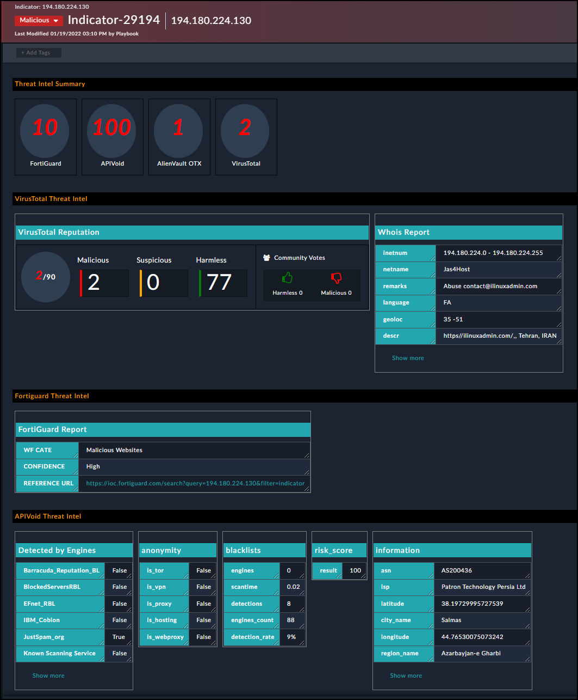
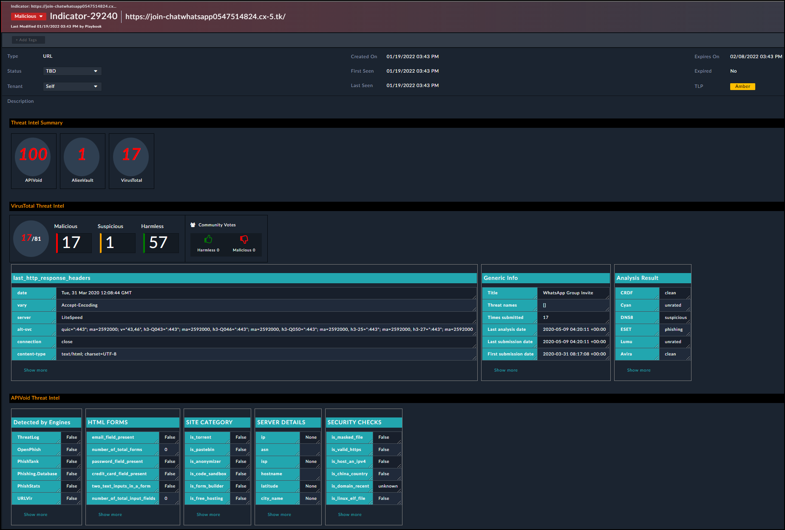
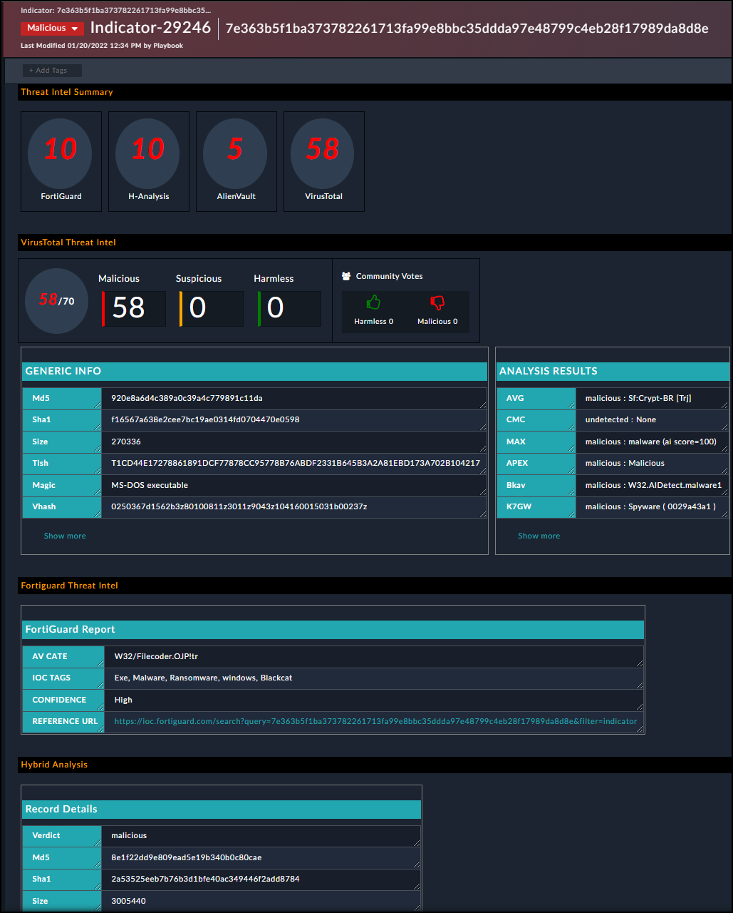
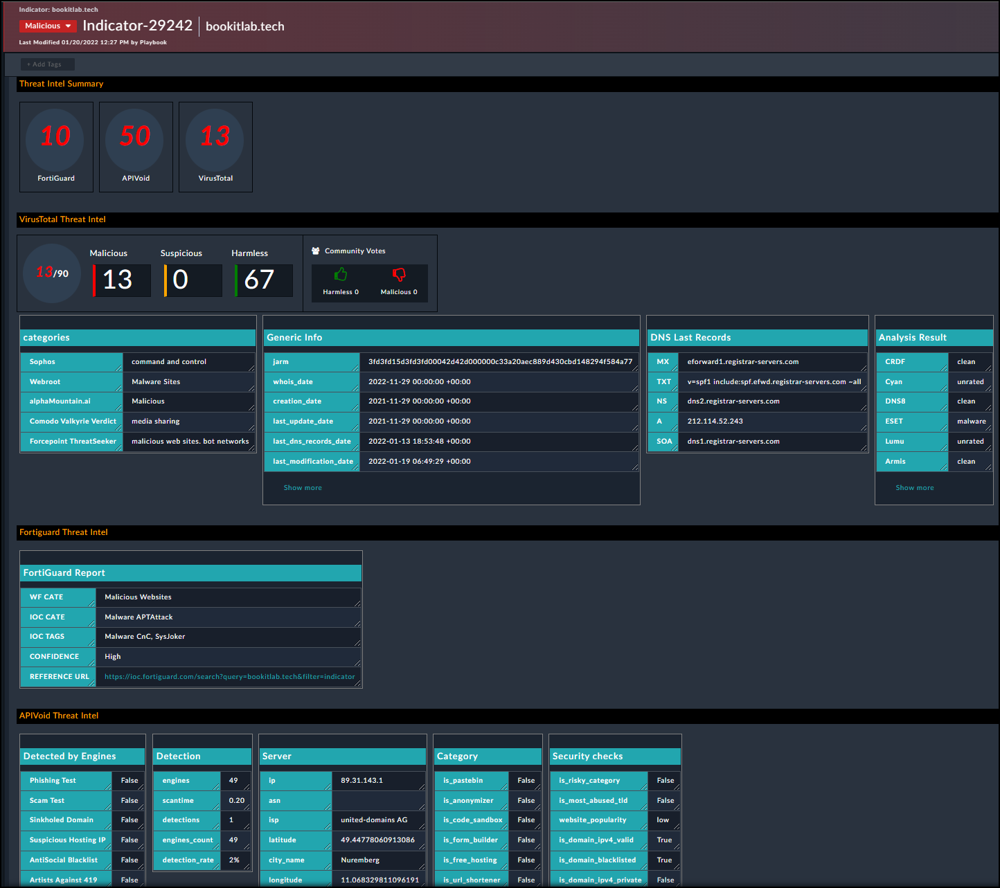
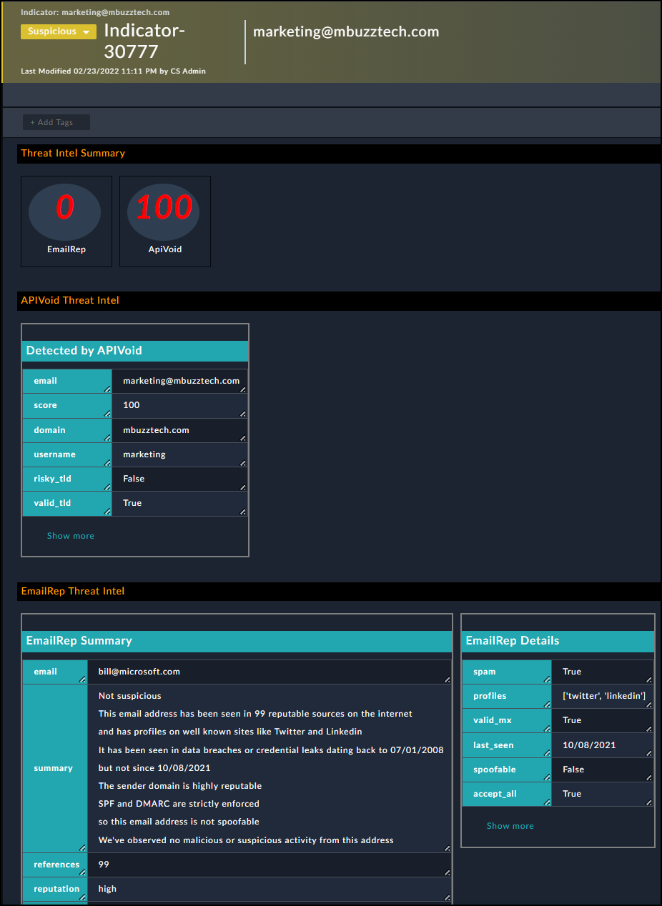

# Currently Supported Indicators Types:

### IP Address

### URL

### Hashcode

### Domain

### Email

# Deployment:

- If you have the default IR content pack, you will need to disable the equivalent playbooks:
    - Indicator (Type Domain) - Get Reputation
    - Indicator (Type MD/SHA1/SHA256) - Get Reputation
    - Indicator (Type IP) - Get Reputation
    - Indicator (Type URL) - Get Reputation
    - Indicator (Type Email) - Get Reputation
- Download the code zip from here (code then Download Zip file)
- Import the playbook collection via the import wizard. Browse to: **Settings -> Import Wizard** and click on **Import from file** selecting the zip file you just downloaded
- Activate the playbooks provided in this content pack (by default all playbooks in this collection are inactive)
